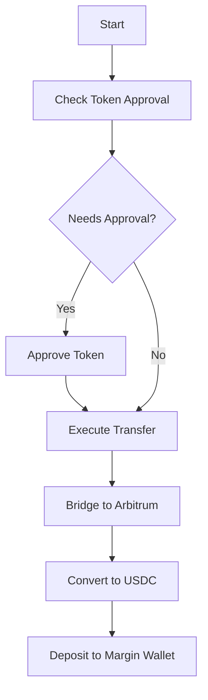

## Overview

The Cross-Chain Deposit endpoint enables deposits from chains other than Arbitrum into your margin wallet. It handles the entire process of bridging tokens and depositing them into your account automatically.

## Request Body

<ResponseField name="userAddress" type="string" required>
  Ethereum address of the user making the deposit
</ResponseField>

<ResponseField name="fromChainId" type="integer" required>
  Chain ID of the source chain where your tokens are currently located
</ResponseField>

<ResponseField name="amount" type="string" required>
  Amount to deposit in token units (including decimals)
</ResponseField>

<ResponseField name="tokenAddress" type="string" required>
  Contract address of the token on the source chain
</ResponseField>

## Process Flow

The cross-chain deposit process follows these steps:

1. Check if token approval is needed
2. If needed, approve token (separate transaction)
3. Execute cross-chain transfer
4. Automatic conversion to Arbitrum USDC
5. Automatic deposit into margin wallet



## Response Fields

### Initial Check Response

<ResponseField name="needsApproval" type="boolean">
  Indicates if token approval is required before deposit
</ResponseField>

<ResponseField name="approvalCalldata" type="string">
  Present if needsApproval is true. Encoded approval transaction data
</ResponseField>

### Deposit Response

<ResponseField name="calldata" type="string">
  Encoded function call data for the cross-chain deposit
</ResponseField>

<ResponseField name="routerAddress" type="string">
  Address of the Squid Router contract
</ResponseField>

## Example Usage

<CodeGroup>
```bash cURL
curl -X POST "https://unidexv4-api-production.up.railway.app/api/crosschaindeposit" \
  -H "Content-Type: application/json" \
  -d '{
    "userAddress": "0x1234567890123456789012345678901234567890",
    "fromChainId": 1,
    "amount": "1000.00",
    "tokenAddress": "0xa0b86991c6218b36c1d19d4a2e9eb0ce3606eb48"
}'
```

```javascript JavaScript
const response = await fetch('https://unidexv4-api-production.up.railway.app/api/crosschaindeposit', {
  method: 'POST',
  headers: {
    'Content-Type': 'application/json'
  },
  body: JSON.stringify({
    userAddress: "0x1234567890123456789012345678901234567890",
    fromChainId: 1,
    amount: "1000.00",
    tokenAddress: "0xa0b86991c6218b36c1d19d4a2e9eb0ce3606eb48"
  })
});
const data = await response.json();
```

```python Python
import requests

response = requests.post(
    'https://unidexv4-api-production.up.railway.app/api/crosschaindeposit',
    json={
        "userAddress": "0x1234567890123456789012345678901234567890",
        "fromChainId": 1,
        "amount": "1000.00",
        "tokenAddress": "0xa0b86991c6218b36c1d19d4a2e9eb0ce3606eb48"
    }
)
data = response.json()
```
</CodeGroup>

## Example Responses

### When Approval Needed

```json
{
  "needsApproval": true,
  "approvalCalldata": "0x095ea7b3...",
  "spenderAddress": "0x5FF137D4b0FDCD49DcA30c7CF57E578a026d2789"
}
```

### When Ready for Deposit

```json
{
  "calldata": "0x4d595245...",
  "routerAddress": "0x5FF137D4b0FDCD49DcA30c7CF57E578a026d2789"
}
```

## Implementation Notes

- Higher fees compared to direct Arbitrum deposits due to cross-chain operations
- Transaction time varies based on source chain and network conditions
- Amount is automatically converted to USDC on Arbitrum
- Requires two transactions if token approval is needed
- Uses Squid Router for cross-chain transfers

## Best Practices

1. **Always Check Approval First**
   - Call endpoint first without sending any transactions
   - Handle approval if needed before proceeding

2. **Handle Network-Specific Requirements**
   - Different chains may have different token decimals
   - Gas fees vary by network
   - Transaction confirmation times vary

3. **Error Handling**
   - Implement proper timeout handling
   - Account for potential cross-chain delays
   - Verify final deposit in margin wallet

## Error Responses

The endpoint will return a 400 status code for:
- Invalid or missing userAddress
- Invalid fromChainId
- Invalid amount format
- Unsupported token or chain
- Invalid token address

A 500 status code will be returned for:
- Router contract errors
- Bridge service unavailability
- Other internal errors
